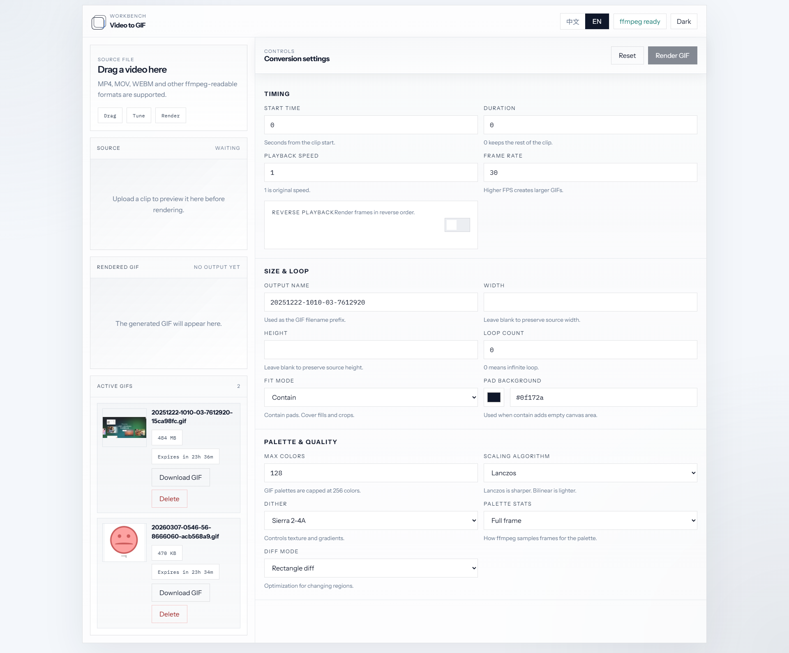
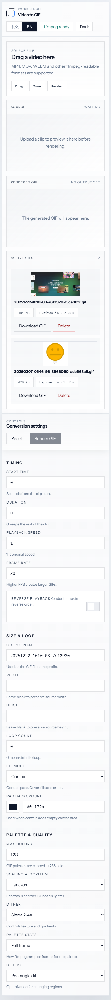

# Video to GIF

Video-to-GIF workbench built with Go, React, and `ffmpeg`.

<p align="center">
  
</p>

<p align="center">
  
</p>

## Overview

This project is a tool-first conversion workspace focused on a fast edit loop:

- drop a video anywhere on the page
- adjust timing, FPS, size, loop, palette, dither, scaling, and reverse playback
- render and preview the GIF immediately
- download, track, and delete active GIFs from the current browser session

## Features

| Area | What it does |
| --- | --- |
| Upload flow | Click-to-upload plus global drag-and-drop across the whole page |
| Conversion controls | Start time, duration, speed, FPS, width, height, fit mode, loop, palette, dither, scaling, reverse |
| Preview | Source video preview and rendered GIF preview in the same workspace |
| Persistence | Conversion parameters stay after refresh until the user presses reset |
| GIF management | Active GIF list with countdown, download, and manual delete |
| Expiration | GIFs expire automatically and are cleaned up by the backend |
| Language | Chinese / English UI switching |
| Theme | Light / dark theme support |
| Storage | Local `outputs/` mode or OpenList WebDAV upload mode |

## Stack

| Layer | Tech |
| --- | --- |
| Frontend | React + Vite |
| Backend | Go |
| Media pipeline | `ffmpeg` |
| Remote storage | OpenList WebDAV (optional) |

## Local Development

Prerequisites:

- Node.js 20+
- `ffmpeg` available in `PATH`
- Go 1.22+ if you want to run the Go backend directly

Install:

```bash
npm install
```

Run backend only:

```bash
npm run server
```

Run full-stack development:

```bash
npm run dev
```

Build frontend:

```bash
npm run build
```

Build then start:

```bash
npm run start:build
```

## Build Linux Bundle

This repository includes a packaging script that packages:

- existing frontend production assets
- Linux `amd64` Go binary
- deployable bundle under `release/video-to-gif-linux-amd64/`

Build frontend first:

```bash
npm run build
```

Then build the Linux bundle:

```bash
npm run build:linux
```

After it finishes, the bundle will contain:

- `video-to-gif`
- `dist/`
- `outputs/`
- `temp/`
- `.env.example`
- `start.sh`
- `DEPLOY.md`

## Deploy To Linux

Upload the generated `release/video-to-gif-linux-amd64/` directory to your server.

Server requirements:

- Linux `amd64`
- `ffmpeg` installed and available in `PATH`

Start the app:

```bash
chmod +x video-to-gif start.sh
./start.sh
```

Or explicitly set the port:

```bash
PORT=430 ./start.sh
```

Note:

- if you write `0430`, the real TCP port is still `430`
- after startup, open `http://your-server:430`

## OpenList Storage

By default, rendered GIFs are stored locally in `outputs/`.

To upload rendered GIFs to OpenList instead, create a `.env` file in the project root or next to the deployed binary:

```env
OPENLIST_BASE_URL=https://your-openlist.example.com
OPENLIST_USERNAME=your-openlist-username
OPENLIST_PASSWORD=your-openlist-password
OPENLIST_VIDEO_PATH=/video-to-gif
```

Notes:

- `OPENLIST_BASE_URL` is your OpenList site URL
- the app uses OpenList WebDAV at `/dav/`
- `OPENLIST_VIDEO_PATH` is the remote folder path inside OpenList
- the OpenList account needs read, upload, and delete related permissions
- in OpenList mode, GIF binaries go to remote storage and local `outputs/` only keeps lightweight metadata

## Runtime Directories

| Path | Purpose |
| --- | --- |
| `dist/` | Frontend build output |
| `temp/` | Temporary upload and palette files |
| `outputs/` | Local GIF files or OpenList metadata manifests |

`temp/` and `outputs/` are runtime directories and should not be committed. The repo only keeps `.gitkeep` placeholders.

## Repository Hygiene

These files or directories are intentionally ignored:

- `node_modules/`
- `dist/`
- `release/`
- `.tools/`
- `.env`
- runtime data under `temp/` and `outputs/`
- IDE files such as `.idea/` and `.vscode/`
- compiled binaries and archive files
